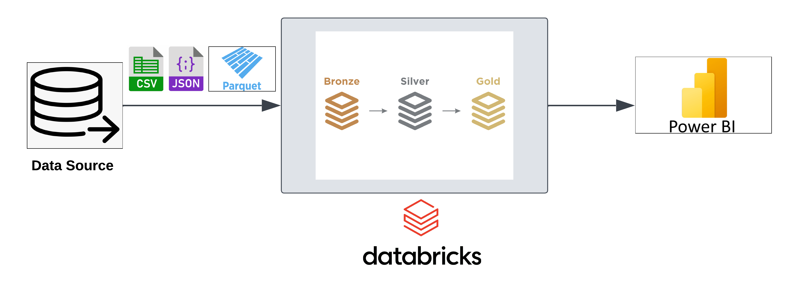

# Retail Data Processing and Analytics Using Delta Lakehouse Architecture

## Architecture Diagram
  
*Figure: Data Engineering Architecture using Delta Lakehouse*

---

## Key Features
- **Bronze Layer:** Raw retail data ingestion from source systems, stored in its original format for traceability.
- **Silver Layer:** Data cleansing, transformation, and integration to create a structured, query-ready dataset.
- **Gold Layer:** Aggregated and business-ready data for advanced analytics and reporting.
- **Delta Lakehouse Architecture:** Ensures scalable, reliable, and efficient data processing with ACID transactions.
- **Power BI Integration:** Created interactive dashboards for retail performance insights.

---

## Technologies Used
- **Databricks:** Data processing and transformation.
- **Delta Lake:** Storage layer for managing Bronze, Silver, and Gold data pipelines.
- **Power BI:** Data visualization and reporting.

---

## Steps in the Workflow
1. **Data Ingestion:** Loaded raw retail data into the Bronze layer using Databricks.
2. **Data Transformation:** Cleaned and structured data in the Silver layer using Spark and Delta Lake.
3. **Aggregation and Enrichment:** Applied business logic to create the Gold layer for analytics.
4. **Visualization:** Connected Power BI to the Gold layer for dynamic retail insights.

---

## Outcomes
- Improved data quality through structured processing layers.
- Enabled data-driven decision-making with comprehensive Power BI dashboards.
- Leveraged Delta Lakehouse for cost-effective and reliable data management.
